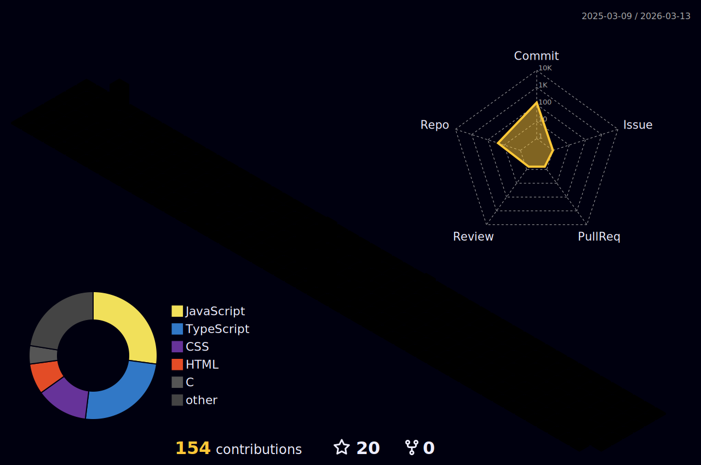

<div align="center">


</div>

<div align="center">

[](https://git.io/typing-svg)

</div>

---

<div align="center">

```c
/**
 * @author  Esthevan
 * @age     18
 * @uni     Universidade Franciscana
 * @focus   C · Java · Sistemas Embarcados · Pesquisa Acadêmica
 * @status  em construção — assim como eu
 */
```

</div>

---

## `$ whoami`

Estudante de Ciência da Computação na Universidade Franciscana, 18 anos.

Comecei com desenvolvimento web — tive experiência prática na área, mas percebi que meu interesse estava em algo mais próximo da máquina. Hoje foco essencialmente em C e Java. C é minha linguagem principal, com olhos voltados para sistemas embarcados, que é o rumo que quero dar à minha carreira. Java estou aprendendo recentemente, mas com seriedade.

O objetivo de longo prazo é a área acadêmica. Quero contribuir com pesquisa em ciência da computação — sistemas de baixo nível é o território que mais me chama.

Este perfil é um registro do processo. Implementações, estudos, exercícios. Nada finalizado, tudo em construção.

---

## `$ uname -a`

<div align="center">

[](https://git.io/typing-svg)

</div>

Tenho uma relação de verdade com sistemas Unix. Linux e FreeBSD me fascinam — a filosofia por trás, a transparência do sistema, a sensação de estar perto da máquina de verdade. Ainda estou aprendendo, explorando o ambiente, entendendo como tudo se conecta por baixo.

Windows é onde tenho experiência sólida — anos de uso intenso, do cotidiano ao técnico. macOS conheço um pouco, o suficiente pra me virar.

<div align="center">


<br>

| Sistema | Relação |
|---|---|
| 🐧 Linux | `aprendendo ativamente — é onde quero viver` |
| 👿 FreeBSD | `explorando — filosofia Unix pura` |
| 🪟 Windows | `experiência sólida de anos` |
| 🍎 macOS | `conheço o suficiente` |

</div>

---

## `$ cat now.log` &nbsp; <sub>📅 estudando em: 27/02/2025</sub>

<div align="center">

[](https://git.io/typing-svg)

</div>

```c
[semana de 27/02/2025]

→ Ponteiros para ponteiros em C — quando achei que tinha entendido, apareceu **ptr
→ Alocação dinâmica de memória e os erros silenciosos que ela traz
→ Java OOP — a diferença de paradigma em relação a C é brutal
→ Como um microcontrolador acorda sem sistema operacional
→ Internals do Linux — o que acontece nos primeiros milissegundos do boot
```

> _Atualizo esta seção toda semana. Se estiver desatualizada, estou com a cabeça enterrada no código._

---

## `$ cat bookshelf.md`

_Livros que estão na mesa agora — não os que já li, os que estou de fato lendo:_

<div align="center">

| 📖 Livro | ✍️ Autor | 📍 Status |
|---|---|---|
| Clean Code | Robert C. Martin | `lendo → refletindo cada capítulo` |

</div>

> _"Qualquer um pode escrever código que um computador entenda. Poucos escrevem código que humanos entendam."_

---

## `$ cat stack.txt`

<div align="center">

🧠 Linguagens


<br>

🛠️ Compiladores & Build


<br>

📝 Editores & IDEs


<br>

🔧 Versionamento


</div>

---

## `$ cat roadmap.md`

```
[✓] Desenvolvimento Web — HTML, CSS, JS
[✓] Lógica de programação e algoritmos básicos
[→] C — ponteiros, memória, estruturas
[→] Java — orientação a objetos, fundamentos
[→] Ambiente Unix/Linux — filosofia, shell, ferramentas
[ ] Sistemas Embarcados — microcontroladores, bare-metal
[ ] Estruturas de Dados e Algoritmos avançados
[ ] Arquitetura de Computadores
[ ] Sistemas Operacionais — internals de verdade
[ ] Pesquisa Acadêmica
```

---

## `$ git log --stats`

<div align="center">


</div>

<div align="center">


</div>

---

## `$ render --3d activity`

> _Para ativar o gráfico 3D, crie o arquivo abaixo no seu repositório de perfil:_

<details>
<summary><sub>⚙️ .github/workflows/3d-contrib.yml — clique para ver</sub></summary>
<br>

```yaml
name: GitHub-Profile-3D-Contrib

on:
  schedule:
    - cron: "0 18 * * *"
  workflow_dispatch:

jobs:
  build:
    runs-on: ubuntu-latest
    name: generate-github-profile-3d-contrib
    steps:
      - uses: actions/checkout@v3
      - uses: yoshi389111/github-profile-3d-contrib@0.7.1
        env:
          GITHUB_TOKEN: ${{ secrets.GITHUB_TOKEN }}
          USERNAME: ${{ github.repository_owner }}
      - name: Commit & Push
        run: |
          git config user.email "action@github.com"
          git config user.name "GitHub Action"
          git add -A .
          git commit -m "generate 3d contrib"
          git push
```

Depois de rodar o workflow uma vez, adicione esta linha ao README no lugar desta seção:

```

```

</details>

<div align="center">


</div>

---

<div align="center">

[](https://git.io/typing-svg)

</div>

---

<div align="center">


</div>

<div align="center">


</div>
